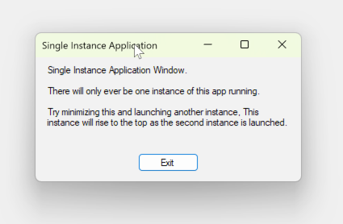

# Single instance app example

This is a sample C# .net windows forms app which employs a mutex and win32 to prevent multiple instances of itself from running and brings the original instance to the foreground when subsequent instances run.

The relevant pieces to achieving this are found in [Program.cs](src/SingleInstanceApp/Program.cs) and [Form1.cs](src/SingleInstanceApp/Form1.cs).

More info on this sample can be found [here](http://sanity-free.org/csharp_dotnet_single_instance_application.html) on my personal website.
